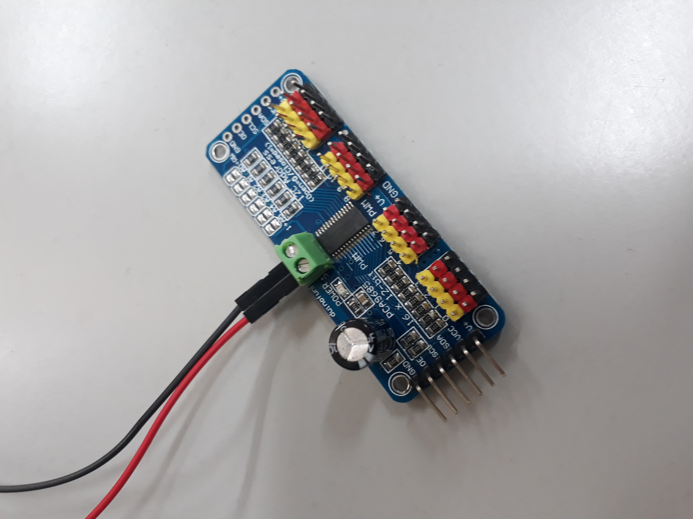
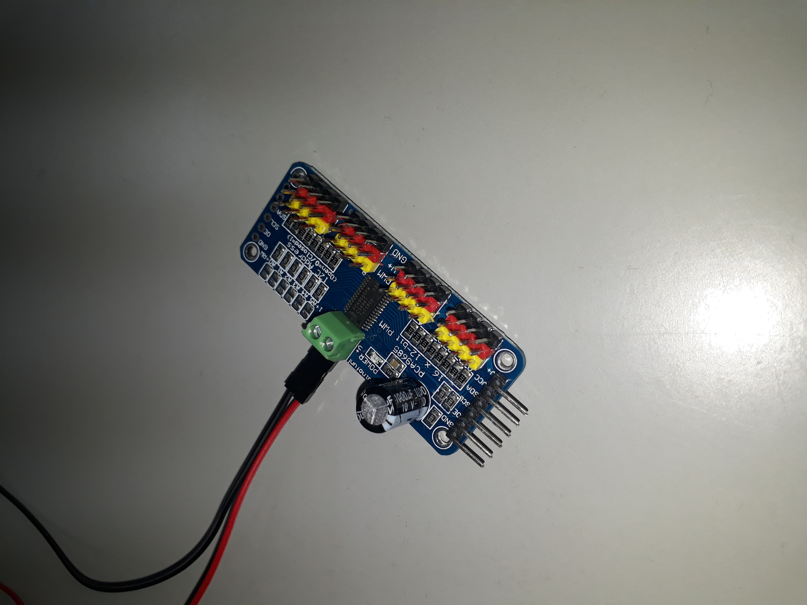

# Diário de Bordo

---
## Abril:
### Semanas:
1. Testes e avaliações das fontes escolhidas para a fase de testes do braço robótica         
2. Levantamento orçamental a respeito das peças que serão utilizadas e pesquisas de artigos científicos para embasamento do trabalho final
3. Conseguindo Garra / Problemas Técnicos        

---
## Semana 1:
### Testes das fontes de energia

Na primeira semana, tivemos como assentamento do projeto, a pesquisa e a realização de um levantamento técnico a cerca das fontes que precisariam ser utilizadas para a alimentação da placa controladora dos Servos Motores - <b>PCA9685</b> -, a qual deveria ser de 5-6V, tivemos êxito no quesito. Por fim, arrematamos a fase de testes concluindo que precisariamos de deck de pilhas AA ou AAA para fornecimento constante de energia para o driver (PCA9685).

(Foto do pwm - pca)

---

## Semana 2:
### Levantamento orçamental e artigos científicos

Na segunda semana, levantamos o orçamento das fontes, apenas por questões de pesquisa, e tambem realizamos pesquisas em sites de artigos científicos para um embasamento em relação ao trabalho final de documentação.          

---

## Semana 3:
### Conseguindo Garra / Problemas Técnicos

Conversamos com o professor que está nos instruindo na matéria do TCC e ele nos disponibilizou uma garra que estava sem uso e disponível.
Entretanto era preciso fazer a parte técnica da programação, além de trocar as varias peças que estavam em um estado abaixo do desejado.    

---

[Voltar para os diários](./menu_diario.md)

