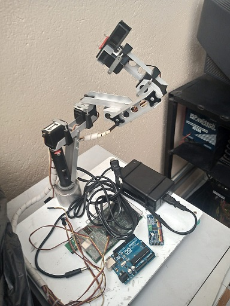

# Diário de Bordo

---
## Fevereiro:
### Semanas:
1. Definição de Grupos / Escolha do Tema
2. Pesquisa de Material
3. Criação da Página no Github
4. Conseguindo Garra / Problemas Técnicos

---
## Semana 1:
### Definição de Grupos:

Durante as primeiras semanas do projeto, era preciso decidir o grupo e identificar as tarefas que cada um iriam realizar. Desse modo o time foi decidio e será formado por 3 integrantes, separados por dois subgrupos:
Documentação: integrado por Mackson M. 

E a parte Técnica: integrada por Matheus V., Igor V.

Após isso, era necessario criar um nome que seria utilizado exclusivamente para se referir ao mesmo, evitando assim a repetição do titulo. 

<i>Clean Software</i>.

### Escolha do Tema:

Dentre os varios temas e inumeras ideias de projetos, o assunto escolhido foi para ajudar o meio ambiente, utilizando uma garra robótica para coletar resíduos tóxicos principalmente lixo hospitalar. O objetivo desse robô é utilizá-lo para limpar sem o contato direto com algum resíduo prejudicial a saúde mantendo a distância e a proteção dos tóxicos.

---

## Semana 2:
### Pesquisa de Material:

O princípio de nossa pesquisa foi com foco na Garra e no Arduino, Também pesquisamos formas de ligar o Arduino à linguagem de programação <i>Python</i> que será a que usaremos nesse projeto pela sua diversidade de integração e facilidade de comunicação.

---

## Semana 3:
### Criação da Página no GitHub:

O responsável da Documentação, Mackson M., criou uma conta no site <i>GitHub</i> para relatar toda a tragetória do trabalho até a conclusão. Em seguida, colocamos as informações: nomes dos integrantes, tema escolhido, objetivo do trabalho e a logo do grupo.

---

## Semana 4:
### Conseguindo Garra:

Conversamos com o prefessor que está nos instruindo na matéria do TCC e ele nos disponibilizou uma garra que estava sem uso e disponível.

Entretanto era preciso fazer a parte tecnica da programação, além de trocar as varias peças que estvam em um estado abaixo do desejado. 

Obs.: É importante lembrar que é apenas um protótipo e por isso não estamos fazendo em uma escala maior, todavia, para uma maior funcionalidade e aproveitamento seria necessário uma maquina industrial.

---

[Voltar para os diários](./menu_diario.md)
