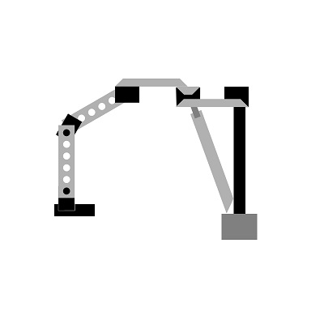
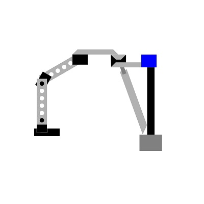
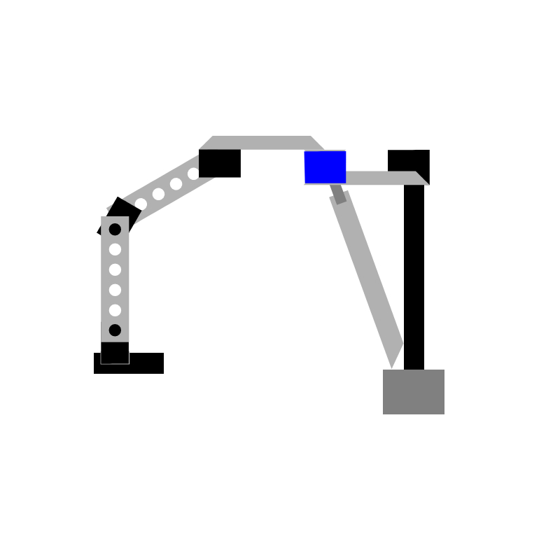
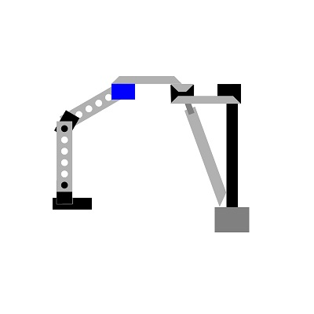
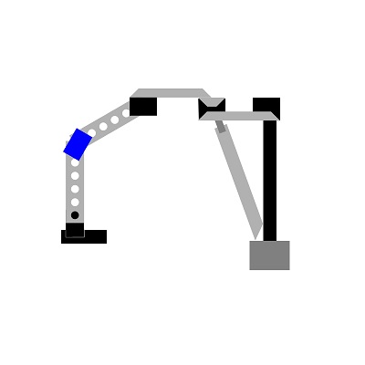
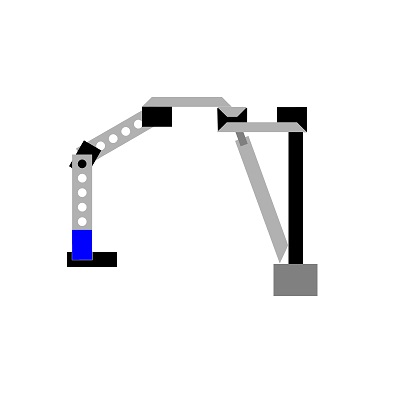

<meta charset="UTF-8">

# Diário de Bordo

---
## Julho:
### Semanas:
1ª e 2ª Nova Atualização na Interface

3ª Modelo Explicativo

---
## Semanas 1 e 2:
<h2>&#129154 Nova Atualização na interface:</h2>

Devido as recentes mudanças no código, precisamos atualizar as interfaces gráficas, gerando assim um novo design muito mais abrangente e interativo, aplicando e testando no projeto físico, tornando-o mais dinâmico. 
Entre todas as interações, nossos codigos vem sendo constantemente atualizados e testados; Atualmente, contamos com mais de 300 linhas de código que compõem o físico e a parte gráfica da interface de controle.                

---
## Semana 3:
<h2>&#129154 Modelo Explicativo:</h2>

### A Revelância dos exemplares com imagens 

Muitas vezes, passamos por um momento de confusão na hora de identificar apenas por palavras oque estamos querendo transmitir, devido à isso precisamos exemplificar de maneira mais prática tudo o que estamos falando, para assim, atingirmos um público alvo mais facilmente, principalmente para as pessoas que são leigas na área. 

Com esse intuito, utilizamos o photoshop para ajudar na visualização das imagens do projeto. 

Como dito anteriormente em outros arquivos, o nosso braço possui cinco servos motores que se mexem conforme o desejo do usúario, se movimentando em direções preestabelecidas e especificamente programadas.

cada servo possui uma numeração própria, se movimentando respectivamente da direita para a esquerda.

<h2>&#129154 Esquema Robô:</h2>

imagem ilustrada do projeto como um todo 

<h2>&#129154 Motores Selecionados:</h2>

Imagem ilustrada do primeiro motor da máquina

Imagem ilustrada do segundo motor da máquina

Imagem ilustrada do terceiro motor da máquina

Imagem ilustrada do quarto motor da máquina

Imagem ilustrada do quinto motor da máquina

---

Voltar para os diários: [clique aqui](./menu_diario.md)                                          
