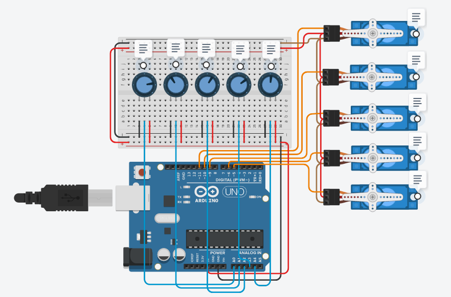
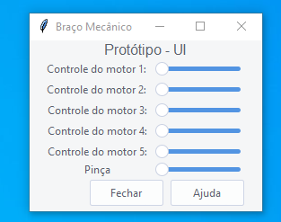

# Diario de Bordo

---
## Março:
### Semanas:
1. Criação digital do protótipo (Embasamento) 
3. Início da criação da Interface Controladora da garra
4. Atualização de documentos
5. Apresentação do trabalho para o professor reitor do projeto

---
## Semana 1:
### Criação digital do protótipo:

Usando a plataforma tinkercad, realizamos um exemplar digital da garra, utilizando arduíno e servos motores. O objetivo era representar a garra em pleno funcionamento de modo simplificado para facilitar a visão e compreensão do funcionamento dos motores, que servirão não só de base mas de apoio na hora de passar o conteúdo para o meio físico.

---

## Semana 2:
### Início da crição da interface:

Utilizando o tkinter, que é uma plataforma de programação que serve tanto para programar pequenas coisas, até programação e orientação de objetos para a linguagem <i>phyton</i>, com isso, a equipe de progamação começou a produção da interface que será utilizada para controle do protótipo e embora esteja em um breve início já tivemos uma base de como irá ficar a nossa interface, sempre é claro, se preocupando em fazer uma interface facil e intuitiva para melhor entendimento e controle do mesmo. 

---

## Semana 3:
### Atualização de documentos:

Como resultado de nosso trabalho, também precisamos atualizar nossos documentos, os quais acrescentamos e mudamos algumas coisas para maior entendimento e acompanhamento linear do projeto.

---

## Semana 4:
### Apresentação do trabalho:

No dia 28 de março, realizamos uma apresentação para o professor e para os outros representantes de seus respectivos projetos, apresentando o que tínhamos criado até o momento em questão.
