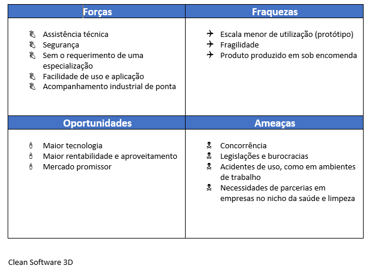
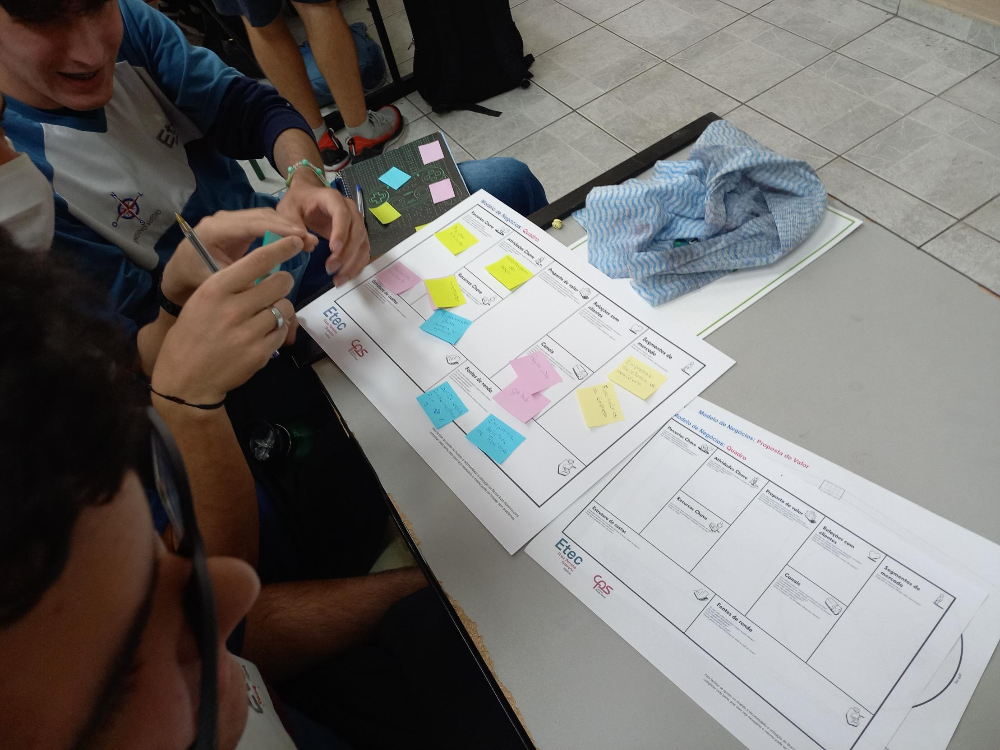
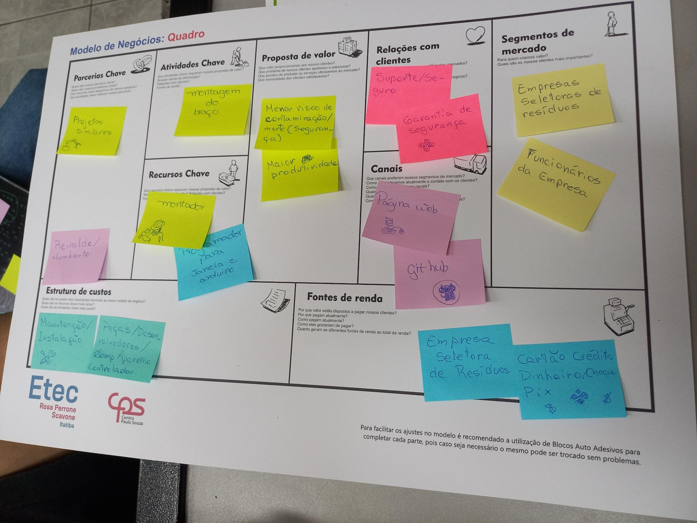
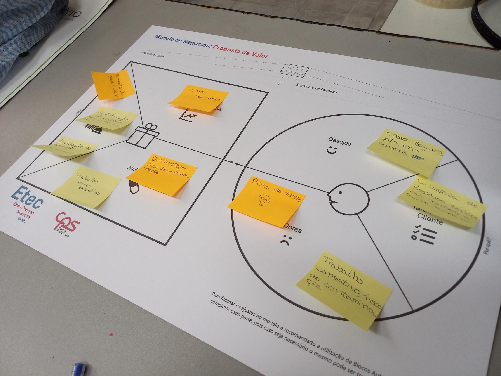
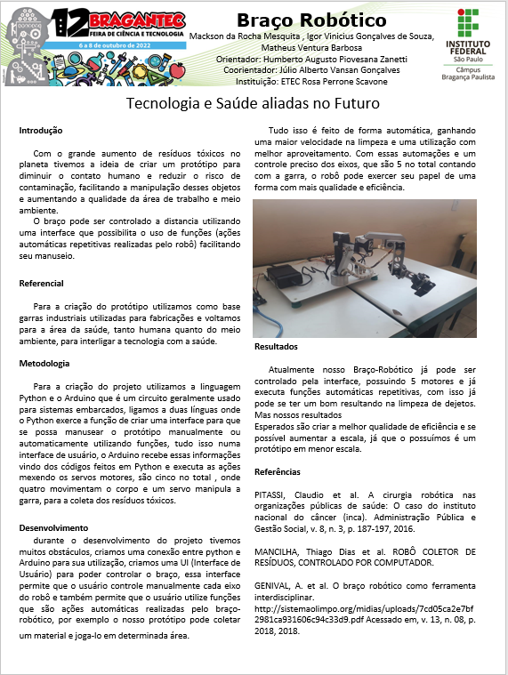

<meta charset="UTF-8">
<h1 style="font-family:verdana; text-align:center; background-color:tomato; color:white">- Braço Robótico -</h1>

Imagem ilustrativa não condizente com a realidade

<h2>&#129154 Projeto:</h2>

  Quando se diz em Desenvolvimento de Sistemas, existem inúmeras áreas a qual podemos aplicar conhecimento e tecnologia a favor, tais áreas podem ser tanto físicas como digitais. Referente ao tema escolhido para a finalização do ano letivo e o TCC, nosso grupo escolheu atuar na área da limpeza e saúde social, na coleta de lixo. Realizando assim, um braço robótico e autônomo (mas que também pode ser controlado) para a coleta de resíduos muito específicos.

<h2>&#129154 Justificativa:</h2>

  A pesquisa a qual nos referimos, está relacionada no âmbito da saúde e pode ser muito útil para a manipulação de lixos, os quais são muito perigosos para serem retirados por pessoas. Muitos desses lixos contêm perigos constantes para os que fazem esse trabalho, e um bom exemplo disso são os lixos eletrônicos, resíduos hospitalares, e até mesmo radioatividade em baixa escala. Isso deve-se ao fato de que colocando seus empregos em prática, eles podem contrair doenças as quais não podem ser curadas ou, se possíveis, apenas com muito tratamento.

  "A geração de lixo hospitalar no Brasil aumentou 20% no mês de junho em comparação a igual período do ano passado." diz estudo sobre o aumento de resíduos hospitalares após a pandemia, alem de cerca de 70% de despejos de outros materiais, isso mostra que com o forte crescimento desenfreado da globalização e o pós pandemia, a tendencia é aumentar ainda mais a escala desses despejos, contudo, com esse aumento mais pessoas estarão colocando suas vidas em risco.

  Com uma base de conhecimento e dados comprováveis, acreditamos que nossa pesquisa poderá ajudar nesse quesito, transferindo a responsabilidade para uma máquina que pode facilmente manipular os sobejos, diminuindo consideravelmente o risco na perda de vidas humanas e facilitando também na separação dos mesmos, para aumentar a facilidade de reciclagem ou despojamento. Logo os motivos foram inspirados na melhora do trabalho e em uma certa “deficiência”, logo que uma vez podem ser fatais esse tipo de contato.

  A automatização e saúde podem ser interligadas com o uso da tecnologia "[...] A robótica envolve uma tecnologia intimamente associada com a automação. A robótica industrial pode ser definida como uma área particular da automação na qual a máquina automática é projetada para substituir a mão de obra humana. As configurações de robôs utilizadas mais comumente na automação industrial incluem os robôs articulados, robôs SCARA, e os robôs cartesianos. No contexto da robótica geral, a maior parte dos robôs industriais seria categorizada como braços robóticos"

  Culminando com as pesquisas realizadas, principalmente durante a pandemia, os resíduos predominantemente hospitalares vem crescendo muito, concluindo-se que nossas pesquisas podem sim ser altamente valiosas para a área da saúde. “[...]Nas últimas décadas uma grande variedade de robôs cirúrgicos foi implantada em hospitais ao redor do mundo, principalmente no EUA. A partir de meados da década de 2000, o uso da robótica em tratamentos médicos atingiu um crescimento vertiginoso nos hospitais de referência, apesar das incertezas ainda existentes” (Pitassi, 2016).

  O robô em questão terá o objetivo de se movimentar e coletar os materiais nocivos. Como diz Mancilha (2005), um protótipo robótico é multifuncional, controlado por computador, pois consegue-se realizar esse tipo de tarefa que é perigoso para o contato humano. Com a intenção de realizar essa tarefa, o grupo incluiu as várias tecnologias utilizáveis no projeto, para a produção do braço agregamos as nossas tecnologias: Arduino, decks de pilha, fontes geradoras de energias, driver, peças metálicas, servos motores etc.

<h2>&#129154 Canvas e Swot:</h2>

Swot

Canvas

<h2>&#129154 Poster:</h2>

Como parte do nosso trabalho de conclusão de curso, nos inscrevemos na feira de ciências de bragança(Bragantec). 

Onde fizemos um poster informativo, mas breve, a cerca do trabalho em questão.

[Voltar para a página inicial](/readme.md)
